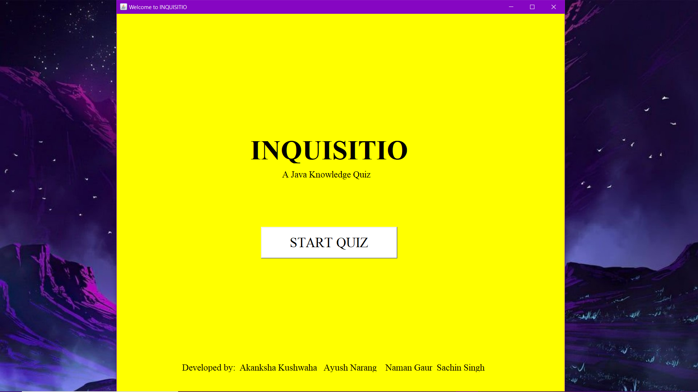
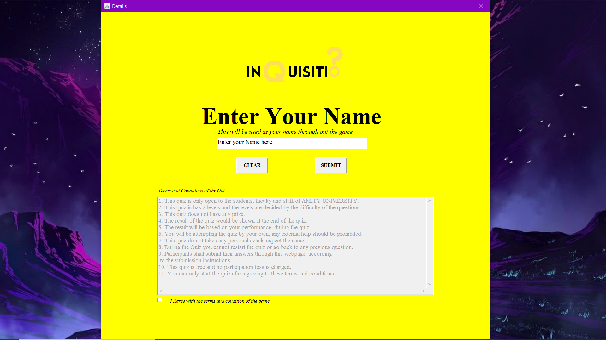
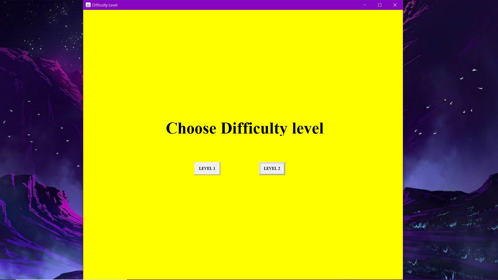
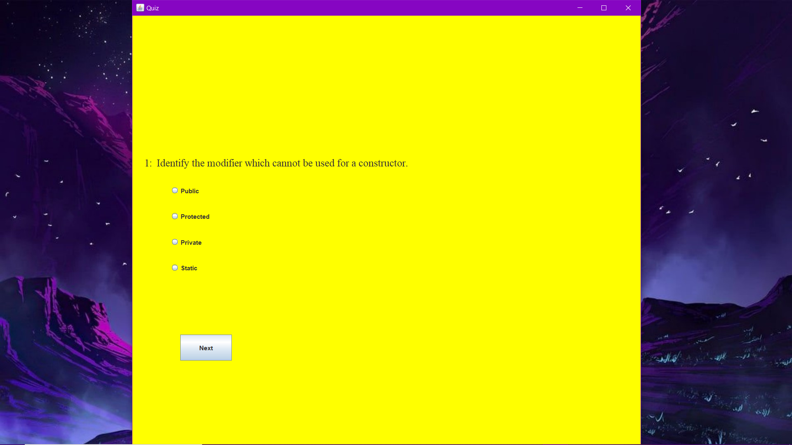
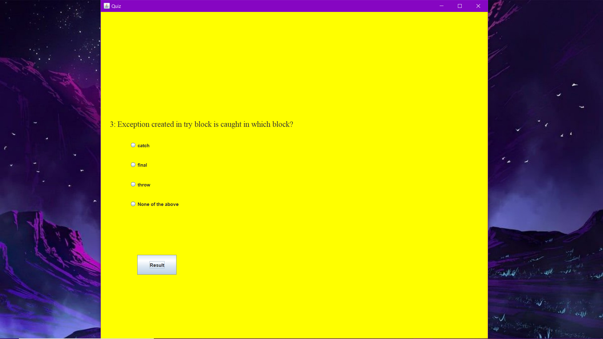
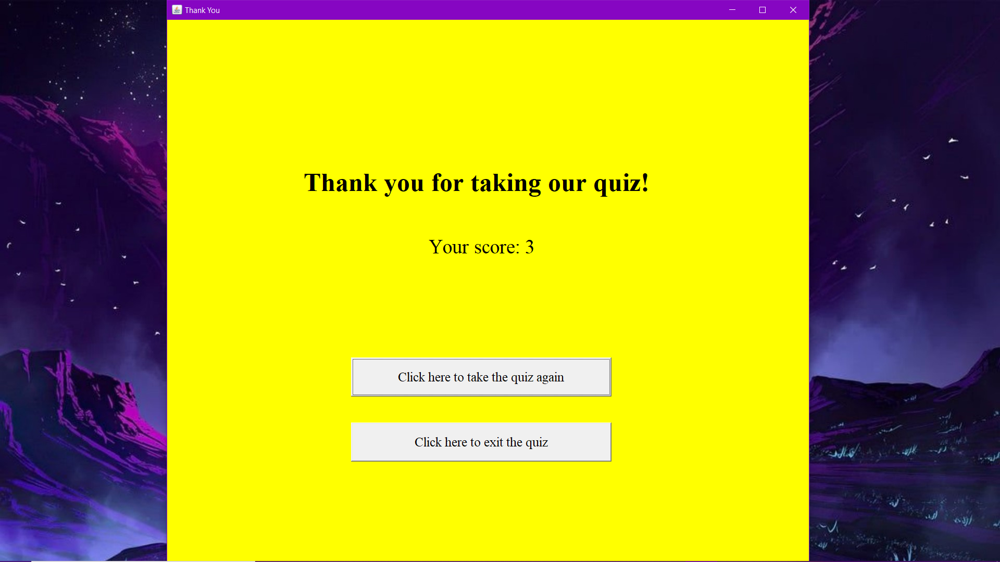

# INQUISITIO

This is a simple Quiz Game Web Application code done in Java using AWT and Swing.

## Screenshots

## AUTHORS

### Akanksha Kushwaha
- [Github](https://github.com/aku1310)
- [LinkedIn](https://www.linkedin.com/in/akankshakushwaha/)

### Ayush Narang
<!-- - [Github](https://github.com/)
- [LinkedIn](https://www.linkedin.com/in/) -->

### Naman Gaur
- [Github](https://github.com/namangaur2)
- [LinkedIn](https://www.linkedin.com/in/naman-gaur-054b581aa/)

### Sachin Singh
<!-- - [Github](https://github.com/)
- [LinkedIn](https://www.linkedin.com/in/) -->